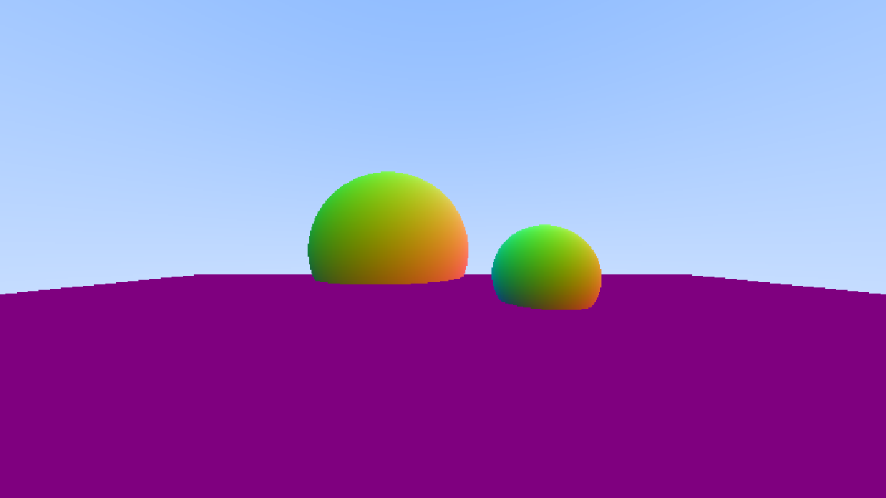
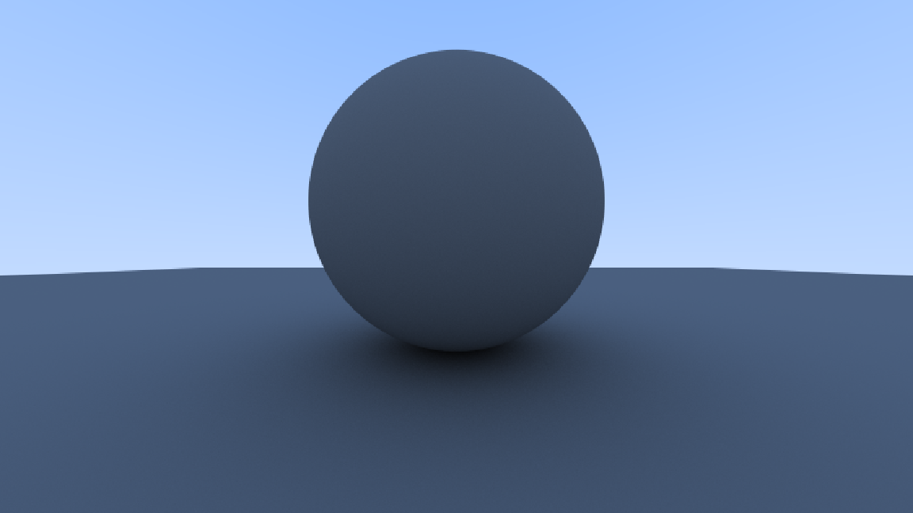
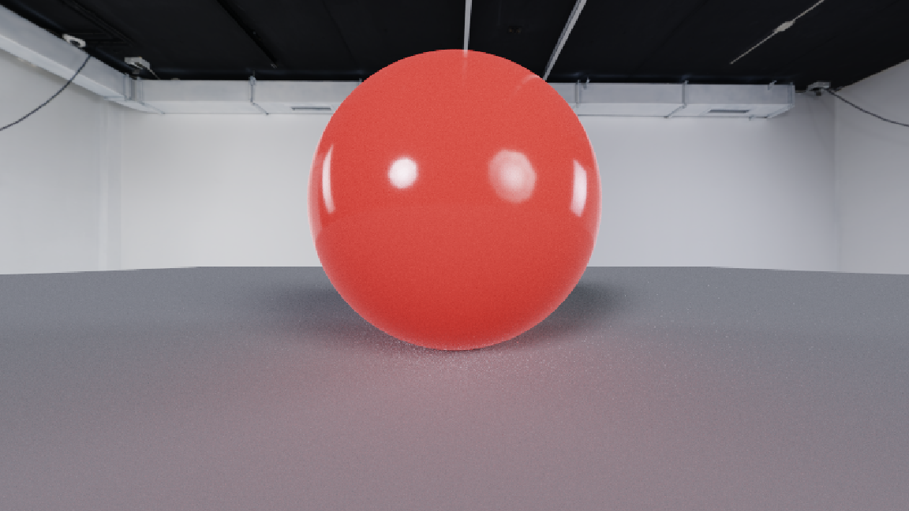
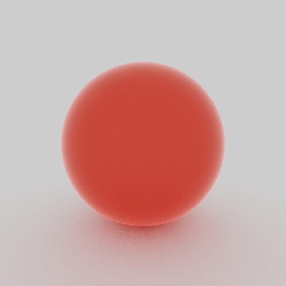
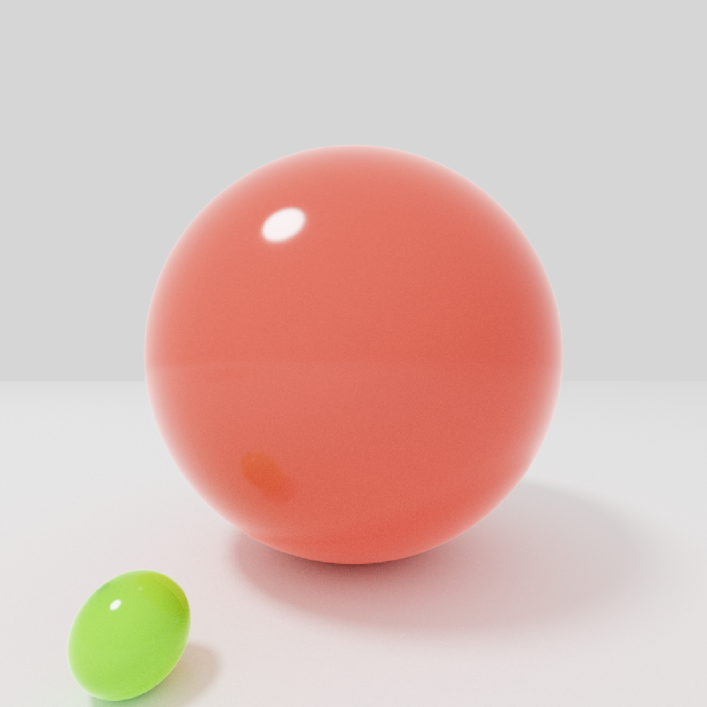

# PathTracer

Monte Carlo path tracer in C++: indirect lighting, glossy materials, and optional HDR environments.

## Features

- **Path tracing** — Multi-bounce Monte Carlo (`ray_colour`), configurable max depth and samples per pixel on the `camera`, with subpixel jitter for antialiasing.
- **Geometry** — Spheres and a finite ground patch (`plane_patch`).
- **Materials** — Lambertian diffuse, **plastic** (diffuse + GGX microfacet specular with mixture sampling and matching PDF), and **diffuse light** (area emitters).
- **Direct lighting** — Next-event estimation toward registered area lights, with **MIS** (power heuristic, β = 2) against the BSDF PDF to reduce fireflies on glossy surfaces.
- **Image-based lighting** — Optional HDR **IBL** (equirectangular importance sampling by luminance; MIS vs material when the env is enabled).
- **Output** — ASCII **P3 PPM** (`image.ppm` by default in `main`).

## Progression

### Stage 1 — Baseline scene

Ray–geometry intersection, camera, and first shaded output (PPM).



### Stage 2 — Path-traced BSDFs

Multi-bounce Monte Carlo with Lambertian diffuse and plastic (GGX specular + mixture sampling), plus supersampled antialiasing.



### Stage 3 — HDR image-based lighting

Equirectangular environment map with luminance-driven importance sampling.



### Stage 3b — Environment × BSDF MIS

Power heuristic (β = 2) between importance-sampled IBL directions and material sampling (lower-variance glossy + env).



### Stage 4 — Area lights and NEE

Emissive geometry with next-event estimation, MIS against the glossy BSDF so direct lighting stays stable.



## Build & run

```bash
make
./PathTracer.exe
```

On Windows you can run `PathTracer.exe` from the project directory. The program writes `image.ppm` in the working directory.
