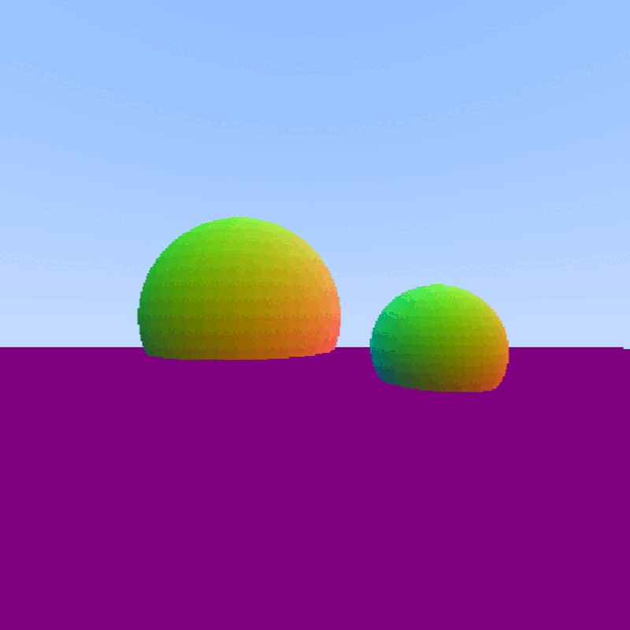

# PathTracer

Monte Carlo path tracer in C++/CUDA: indirect lighting, glossy materials, and optional HDR environments.

## Features

- **Path tracing** — Multi-bounce Monte Carlo (`ray_colour`), configurable max depth and samples per pixel on the `camera`, with subpixel jitter for antialiasing.
- **CUDA** — Default render path is a GPU pixel kernel (`src/cuda/ray_colour.cu`). Geometry, materials, and lights are packed into tables, copied to the device, and traced with the same `HOST_DEVICE` `ray_colour` as the CPU fallback (`render_cpu` in `camera.h`).
- **Geometry** — Spheres and a finite ground patch (`plane_patch`).
- **Materials** — Lambertian diffuse, **plastic** (diffuse + GGX microfacet specular with mixture sampling and matching PDF), and **diffuse light** (area emitters).
- **Direct lighting** — Next-event estimation toward registered area lights, with **MIS** (power heuristic, β = 2) against the BSDF PDF to reduce fireflies on glossy surfaces.
- **Image-based lighting** — Optional HDR **IBL** (equirectangular importance sampling by luminance; MIS vs material when the env is enabled).
- **Camera** — Thin-lens **depth of field** (`aperture` + `focus_dist`) and ACES filmic tonemapping with exposure.
- **Scenes** — YAML scene files (`scenes/default.yaml` by default; pass a path as the first argument).
- **Output** — ASCII **P3 PPM** (`image.ppm` by default in `main`).

## Progression



**Stage 1 — Baseline scene.** Ray–geometry intersection, camera, and first shaded output (PPM).

**Stage 2 — Path-traced BSDFs.** Multi-bounce Monte Carlo with Lambertian diffuse and plastic (GGX specular + mixture sampling), plus supersampled antialiasing.

**Stage 3 — HDR image-based lighting.** Equirectangular environment map with luminance-driven importance sampling.

**Stage 3b — Environment × BSDF MIS.** Power heuristic (β = 2) between importance-sampled IBL directions and material sampling (lower-variance glossy + env).

**Stage 4 — Area lights and NEE.** Emissive geometry with next-event estimation, MIS against the glossy BSDF so direct lighting stays stable.

**Stage 5 — Depth of field.** Thin-lens camera (`aperture` / `focus_dist`) for defocus blur on objects off the focal plane.

## Build & run

Requires the **CUDA Toolkit** (CMake enables `LANGUAGES CXX CUDA` and links `CUDA::cudart`). Architectures are `native`, so configure on a machine with an NVIDIA GPU.

From the **Developer Command Prompt for VS** (or any shell where `cl` and `nvcc` are on `PATH`):

```cmd
cmake -S . -B build -G "Visual Studio 17 2022" -A x64
cmake --build build --config Release
build\Release\PathTracer.exe
```

For a fast terminal build with Ninja:

```cmd
cmake -S . -B build -G Ninja -DCMAKE_BUILD_TYPE=Release
cmake --build build
build\PathTracer.exe
```

The program writes `image.ppm` in the working directory. Pass a YAML path to use a different scene (`scenes/default.yaml` is the default).
